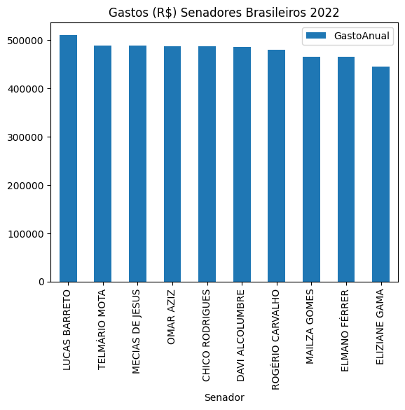
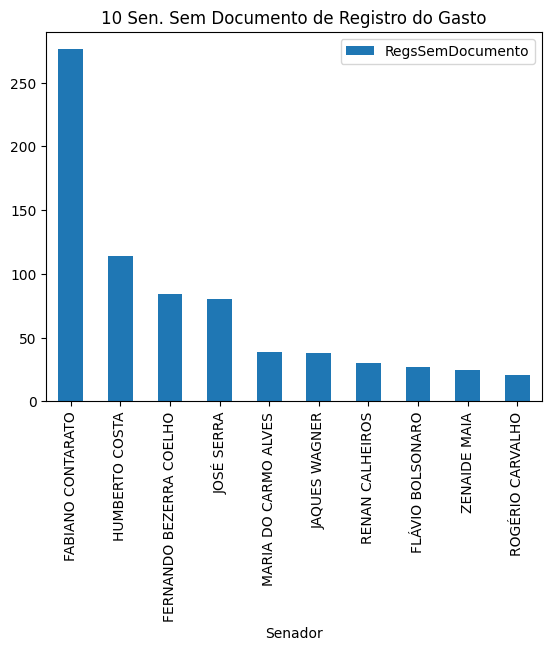

# Dados Abertos - Senado Brasileiro, CEAPS

Os presentes dados estão disponíveis publicamente no site do governo brasileiro como parte da politica de acesso a dados públicos de forma aberta afim de ter-se transparência nos gastos públicos.


[Senado.leg.br Site dos dados](https://www12.senado.leg.br/transparencia/dados-abertos-transparencia/dados-abertos-ceaps)

## Carregando módulos usados na análise.

Bibliotecas usadas para carregamentos dos dados, cálculos e renderização dos gráficos.

Incluem:

[Numpy](https://numpy.org/)

[Pandas](https://pandas.pydata.org/)

[Matplotlib](https://matplotlib.org/)

[Plotly - Visualização de dados](https://plotly.com/)


```python
import numpy as np
import pandas as pd
import matplotlib.pyplot as plt
import plotly.express as px
import re
import csv
import glob
%matplotlib inline

#pd.options.plotting.backend = "plotly"
```

## Carregamento dos Dados


### Sobre os Dados

Diversas inconsistências e dados faltantes em campos. Detalhes como datas e informação de documento faltando, ou data não preenchida ou preenchida de forma incompleta.


### Ano de 2022

Amostra para o ano de 2022


```python
# header=1 -> ignore first line header
df = pd.read_csv('data/despesa_ceaps_2022.csv', delimiter=';', header=1, encoding='iso-8859-1')
df.head()
```


<div>
<style scoped>
    .dataframe tbody tr th:only-of-type {
        vertical-align: middle;
    }

    .dataframe tbody tr th {
        vertical-align: top;
    }

    .dataframe thead th {
        text-align: right;
    }
</style>
<table border="1" class="dataframe">
  <thead>
    <tr style="text-align: right;">
      <th></th>
      <th>ANO</th>
      <th>MES</th>
      <th>SENADOR</th>
      <th>TIPO_DESPESA</th>
      <th>CNPJ_CPF</th>
      <th>FORNECEDOR</th>
      <th>DOCUMENTO</th>
      <th>DATA</th>
      <th>DETALHAMENTO</th>
      <th>VALOR_REEMBOLSADO</th>
      <th>COD_DOCUMENTO</th>
    </tr>
  </thead>
  <tbody>
    <tr>
      <th>0</th>
      <td>2022</td>
      <td>1</td>
      <td>ACIR GURGACZ</td>
      <td>Aluguel de imóveis para escritório político, c...</td>
      <td>004.948.028-63</td>
      <td>GILBERTO PISELO DO NASCIMENTO</td>
      <td>001/22</td>
      <td>03/01/2022</td>
      <td>Despesa com pagamento de aluguel de imóvel par...</td>
      <td>6000</td>
      <td>2173614</td>
    </tr>
    <tr>
      <th>1</th>
      <td>2022</td>
      <td>1</td>
      <td>ACIR GURGACZ</td>
      <td>Divulgação da atividade parlamentar</td>
      <td>26.320.603/0001-64</td>
      <td>INFORMANAHORA</td>
      <td>000000000000310/A</td>
      <td>04/01/2022</td>
      <td>Despesa com divulgação da atividade parlamenta...</td>
      <td>1500</td>
      <td>2173615</td>
    </tr>
    <tr>
      <th>2</th>
      <td>2022</td>
      <td>1</td>
      <td>ACIR GURGACZ</td>
      <td>Divulgação da atividade parlamentar</td>
      <td>13.659.201/0001-47</td>
      <td>LINHA PURPURA FOTO E VIDEO LTDA</td>
      <td>107</td>
      <td>14/01/2022</td>
      <td>Despesa com produção de texto e edição de víde...</td>
      <td>6000</td>
      <td>2173616</td>
    </tr>
    <tr>
      <th>3</th>
      <td>2022</td>
      <td>1</td>
      <td>ACIR GURGACZ</td>
      <td>Divulgação da atividade parlamentar</td>
      <td>23.652.846/0001-01</td>
      <td>ROBERTO GUTIERREZ DA ROCHA M.E.I.</td>
      <td>187</td>
      <td>18/01/2022</td>
      <td>Divulgação da atividade parlamentar</td>
      <td>1000</td>
      <td>2173618</td>
    </tr>
    <tr>
      <th>4</th>
      <td>2022</td>
      <td>1</td>
      <td>ACIR GURGACZ</td>
      <td>Divulgação da atividade parlamentar</td>
      <td>08.941.827/0001-01</td>
      <td>RONDONIA DINÂMICA COM. E SERV. DE INFORMÁTICA ...</td>
      <td>000000000001772/A</td>
      <td>17/01/2022</td>
      <td>Divulgação da atividade parlamentar</td>
      <td>2000</td>
      <td>2173617</td>
    </tr>
  </tbody>
</table>
</div>


### Todos Anos 2008/2022

Carregando lista de arquivos contendo os dados para análise.


```python
datas = {}
for file in sorted(glob.glob('data/*.csv')):
    
    if re.search(r'[0-9]+(.csv)', file):
        print('> load... ', file)
        datas[ re.search(r'[0-9]+', file ).group(0) ] = pd.read_csv(file, delimiter=';', header=1, encoding='iso-8859-1')
#(lambda d, x: [d.pop(i) for i in x] )(datas, ['2008','2009', '2010', '2011','2012'])
```

    > load...  data/despesa_ceaps_2008.csv
    > load...  data/despesa_ceaps_2009.csv
    > load...  data/despesa_ceaps_2010.csv
    > load...  data/despesa_ceaps_2011.csv
    > load...  data/despesa_ceaps_2012.csv
    > load...  data/despesa_ceaps_2013.csv
    > load...  data/despesa_ceaps_2014.csv
    > load...  data/despesa_ceaps_2015.csv
    > load...  data/despesa_ceaps_2016.csv
    > load...  data/despesa_ceaps_2017.csv
    > load...  data/despesa_ceaps_2018.csv
    > load...  data/despesa_ceaps_2019.csv
    > load...  data/despesa_ceaps_2020.csv
    > load...  data/despesa_ceaps_2021.csv
    > load...  data/despesa_ceaps_2022.csv


### Pré-Processamento dos Dados

Concatenando as tabelas de dados para formar um único da dataframe com os dados para análise.


```python
dff = pd.concat(datas, ignore_index=True)

```


```python
dff.loc[0:dff.shape[0],'VALOR_REEMBOLSADO'].replace(r'(\s)', '', regex=True, inplace=True)
dff.loc[0:dff.shape[0],'VALOR_REEMBOLSADO'].replace(r'(\n)','', regex=True, inplace=True)
dff.loc[0:dff.shape[0], 'VALOR_REEMBOLSADO'].replace(r'(\r)', '', regex=True, inplace=True)
dff.head()
```


<div>
<style scoped>
    .dataframe tbody tr th:only-of-type {
        vertical-align: middle;
    }

    .dataframe tbody tr th {
        vertical-align: top;
    }

    .dataframe thead th {
        text-align: right;
    }
</style>
<table border="1" class="dataframe">
  <thead>
    <tr style="text-align: right;">
      <th></th>
      <th>ANO</th>
      <th>MES</th>
      <th>SENADOR</th>
      <th>TIPO_DESPESA</th>
      <th>CNPJ_CPF</th>
      <th>FORNECEDOR</th>
      <th>DOCUMENTO</th>
      <th>DATA</th>
      <th>DETALHAMENTO</th>
      <th>VALOR_REEMBOLSADO</th>
      <th>COD_DOCUMENTO</th>
    </tr>
  </thead>
  <tbody>
    <tr>
      <th>0</th>
      <td>2008</td>
      <td>9</td>
      <td>ADA MELLO</td>
      <td>Contratação de consultorias, assessorias, pesq...</td>
      <td>NaN</td>
      <td>NaN</td>
      <td>NaN</td>
      <td>NaN</td>
      <td>NaN</td>
      <td>12351,52</td>
      <td>2.008091e+12</td>
    </tr>
    <tr>
      <th>1</th>
      <td>2008</td>
      <td>9</td>
      <td>ADA MELLO</td>
      <td>Locomoção, hospedagem, alimentação, combustíve...</td>
      <td>NaN</td>
      <td>NaN</td>
      <td>NaN</td>
      <td>NaN</td>
      <td>NaN</td>
      <td>386,6</td>
      <td>2.008091e+12</td>
    </tr>
    <tr>
      <th>2</th>
      <td>2008</td>
      <td>10</td>
      <td>ADA MELLO</td>
      <td>Contratação de consultorias, assessorias, pesq...</td>
      <td>NaN</td>
      <td>NaN</td>
      <td>NaN</td>
      <td>NaN</td>
      <td>NaN</td>
      <td>12351,52</td>
      <td>2.008101e+12</td>
    </tr>
    <tr>
      <th>3</th>
      <td>2008</td>
      <td>10</td>
      <td>ADA MELLO</td>
      <td>Locomoção, hospedagem, alimentação, combustíve...</td>
      <td>NaN</td>
      <td>NaN</td>
      <td>NaN</td>
      <td>NaN</td>
      <td>NaN</td>
      <td>2610,68</td>
      <td>2.008101e+12</td>
    </tr>
    <tr>
      <th>4</th>
      <td>2008</td>
      <td>11</td>
      <td>ADA MELLO</td>
      <td>Contratação de consultorias, assessorias, pesq...</td>
      <td>NaN</td>
      <td>NaN</td>
      <td>NaN</td>
      <td>NaN</td>
      <td>NaN</td>
      <td>12351,52</td>
      <td>2.008111e+12</td>
    </tr>
  </tbody>
</table>
</div>


```python
dff.loc[0:,'VALOR_REEMBOLSADO'].replace( regex=r'(,)', value='.',  inplace=True )
#dff.loc[0:dff.shape[0],'VALOR_REEMBOLSADO'] =dff.loc[0:dff.shape[0],'VALOR_REEMBOLSADO'].replace( regex={r'(,)':'.'} )
#dfs['VALOR_REEMBOLSADO'] = pd.to_numeric(dff['VALOR_REEMBOLSADO'], downcast='float')
dff.head()
```


<div>
<style scoped>
    .dataframe tbody tr th:only-of-type {
        vertical-align: middle;
    }

    .dataframe tbody tr th {
        vertical-align: top;
    }

    .dataframe thead th {
        text-align: right;
    }
</style>
<table border="1" class="dataframe">
  <thead>
    <tr style="text-align: right;">
      <th></th>
      <th>ANO</th>
      <th>MES</th>
      <th>SENADOR</th>
      <th>TIPO_DESPESA</th>
      <th>CNPJ_CPF</th>
      <th>FORNECEDOR</th>
      <th>DOCUMENTO</th>
      <th>DATA</th>
      <th>DETALHAMENTO</th>
      <th>VALOR_REEMBOLSADO</th>
      <th>COD_DOCUMENTO</th>
    </tr>
  </thead>
  <tbody>
    <tr>
      <th>0</th>
      <td>2008</td>
      <td>9</td>
      <td>ADA MELLO</td>
      <td>Contratação de consultorias, assessorias, pesq...</td>
      <td>NaN</td>
      <td>NaN</td>
      <td>NaN</td>
      <td>NaN</td>
      <td>NaN</td>
      <td>12351.52</td>
      <td>2.008091e+12</td>
    </tr>
    <tr>
      <th>1</th>
      <td>2008</td>
      <td>9</td>
      <td>ADA MELLO</td>
      <td>Locomoção, hospedagem, alimentação, combustíve...</td>
      <td>NaN</td>
      <td>NaN</td>
      <td>NaN</td>
      <td>NaN</td>
      <td>NaN</td>
      <td>386.6</td>
      <td>2.008091e+12</td>
    </tr>
    <tr>
      <th>2</th>
      <td>2008</td>
      <td>10</td>
      <td>ADA MELLO</td>
      <td>Contratação de consultorias, assessorias, pesq...</td>
      <td>NaN</td>
      <td>NaN</td>
      <td>NaN</td>
      <td>NaN</td>
      <td>NaN</td>
      <td>12351.52</td>
      <td>2.008101e+12</td>
    </tr>
    <tr>
      <th>3</th>
      <td>2008</td>
      <td>10</td>
      <td>ADA MELLO</td>
      <td>Locomoção, hospedagem, alimentação, combustíve...</td>
      <td>NaN</td>
      <td>NaN</td>
      <td>NaN</td>
      <td>NaN</td>
      <td>NaN</td>
      <td>2610.68</td>
      <td>2.008101e+12</td>
    </tr>
    <tr>
      <th>4</th>
      <td>2008</td>
      <td>11</td>
      <td>ADA MELLO</td>
      <td>Contratação de consultorias, assessorias, pesq...</td>
      <td>NaN</td>
      <td>NaN</td>
      <td>NaN</td>
      <td>NaN</td>
      <td>NaN</td>
      <td>12351.52</td>
      <td>2.008111e+12</td>
    </tr>
  </tbody>
</table>
</div>


```python
dff.loc[0:, 'VALOR_REEMBOLSADO'] = pd.to_numeric(dff.loc[0:,'VALOR_REEMBOLSADO'], downcast='float')
#dff.dropna(inplace=True)
#dff.to_csv('data.csv', index=False)
```

    /tmp/ipykernel_32115/1191592795.py:1: FutureWarning: In a future version, `df.iloc[:, i] = newvals` will attempt to set the values inplace instead of always setting a new array. To retain the old behavior, use either `df[df.columns[i]] = newvals` or, if columns are non-unique, `df.isetitem(i, newvals)`
      dff.loc[0:, 'VALOR_REEMBOLSADO'] = pd.to_numeric(dff.loc[0:,'VALOR_REEMBOLSADO'], downcast='float')


## Tratamento e Limpeza dos Dados (Data Wrangling)

No campo 'VALOR_REEMBOLSADO' trocar virgula por ponto e converter para tipo numérico (float).


```python
df['VALOR_REEMBOLSADO'] = pd.to_numeric( df['VALOR_REEMBOLSADO'].replace(regex=r'(,)', value='.'), downcast='float')


```


```python
df.head()
```


<div>
<style scoped>
    .dataframe tbody tr th:only-of-type {
        vertical-align: middle;
    }

    .dataframe tbody tr th {
        vertical-align: top;
    }

    .dataframe thead th {
        text-align: right;
    }
</style>
<table border="1" class="dataframe">
  <thead>
    <tr style="text-align: right;">
      <th></th>
      <th>ANO</th>
      <th>MES</th>
      <th>SENADOR</th>
      <th>TIPO_DESPESA</th>
      <th>CNPJ_CPF</th>
      <th>FORNECEDOR</th>
      <th>DOCUMENTO</th>
      <th>DATA</th>
      <th>DETALHAMENTO</th>
      <th>VALOR_REEMBOLSADO</th>
      <th>COD_DOCUMENTO</th>
    </tr>
  </thead>
  <tbody>
    <tr>
      <th>0</th>
      <td>2022</td>
      <td>1</td>
      <td>ACIR GURGACZ</td>
      <td>Aluguel de imóveis para escritório político, c...</td>
      <td>004.948.028-63</td>
      <td>GILBERTO PISELO DO NASCIMENTO</td>
      <td>001/22</td>
      <td>03/01/2022</td>
      <td>Despesa com pagamento de aluguel de imóvel par...</td>
      <td>6000.0</td>
      <td>2173614</td>
    </tr>
    <tr>
      <th>1</th>
      <td>2022</td>
      <td>1</td>
      <td>ACIR GURGACZ</td>
      <td>Divulgação da atividade parlamentar</td>
      <td>26.320.603/0001-64</td>
      <td>INFORMANAHORA</td>
      <td>000000000000310/A</td>
      <td>04/01/2022</td>
      <td>Despesa com divulgação da atividade parlamenta...</td>
      <td>1500.0</td>
      <td>2173615</td>
    </tr>
    <tr>
      <th>2</th>
      <td>2022</td>
      <td>1</td>
      <td>ACIR GURGACZ</td>
      <td>Divulgação da atividade parlamentar</td>
      <td>13.659.201/0001-47</td>
      <td>LINHA PURPURA FOTO E VIDEO LTDA</td>
      <td>107</td>
      <td>14/01/2022</td>
      <td>Despesa com produção de texto e edição de víde...</td>
      <td>6000.0</td>
      <td>2173616</td>
    </tr>
    <tr>
      <th>3</th>
      <td>2022</td>
      <td>1</td>
      <td>ACIR GURGACZ</td>
      <td>Divulgação da atividade parlamentar</td>
      <td>23.652.846/0001-01</td>
      <td>ROBERTO GUTIERREZ DA ROCHA M.E.I.</td>
      <td>187</td>
      <td>18/01/2022</td>
      <td>Divulgação da atividade parlamentar</td>
      <td>1000.0</td>
      <td>2173618</td>
    </tr>
    <tr>
      <th>4</th>
      <td>2022</td>
      <td>1</td>
      <td>ACIR GURGACZ</td>
      <td>Divulgação da atividade parlamentar</td>
      <td>08.941.827/0001-01</td>
      <td>RONDONIA DINÂMICA COM. E SERV. DE INFORMÁTICA ...</td>
      <td>000000000001772/A</td>
      <td>17/01/2022</td>
      <td>Divulgação da atividade parlamentar</td>
      <td>2000.0</td>
      <td>2173617</td>
    </tr>
  </tbody>
</table>
</div>


Converter campo 'DATA' do tipo string para tipo Date. Campos de data não preenchidos ou preenchidos em formato incorreto será ignorados mantendo conteúdo antigo sem ser convertido para o tipo _"datetime"_ do Python.


```python
# Converter DATA para tipo Date
df['DATA'] = pd.to_datetime(df['DATA'], dayfirst=True, errors='ignore')
```

### Tabela dos Dados Pré-processada e Tratada


```python
df
```


<div>
<style scoped>
    .dataframe tbody tr th:only-of-type {
        vertical-align: middle;
    }

    .dataframe tbody tr th {
        vertical-align: top;
    }

    .dataframe thead th {
        text-align: right;
    }
</style>
<table border="1" class="dataframe">
  <thead>
    <tr style="text-align: right;">
      <th></th>
      <th>ANO</th>
      <th>MES</th>
      <th>SENADOR</th>
      <th>TIPO_DESPESA</th>
      <th>CNPJ_CPF</th>
      <th>FORNECEDOR</th>
      <th>DOCUMENTO</th>
      <th>DATA</th>
      <th>DETALHAMENTO</th>
      <th>VALOR_REEMBOLSADO</th>
      <th>COD_DOCUMENTO</th>
    </tr>
  </thead>
  <tbody>
    <tr>
      <th>0</th>
      <td>2022</td>
      <td>1</td>
      <td>ACIR GURGACZ</td>
      <td>Aluguel de imóveis para escritório político, c...</td>
      <td>004.948.028-63</td>
      <td>GILBERTO PISELO DO NASCIMENTO</td>
      <td>001/22</td>
      <td>2022-01-03</td>
      <td>Despesa com pagamento de aluguel de imóvel par...</td>
      <td>6000.00</td>
      <td>2173614</td>
    </tr>
    <tr>
      <th>1</th>
      <td>2022</td>
      <td>1</td>
      <td>ACIR GURGACZ</td>
      <td>Divulgação da atividade parlamentar</td>
      <td>26.320.603/0001-64</td>
      <td>INFORMANAHORA</td>
      <td>000000000000310/A</td>
      <td>2022-01-04</td>
      <td>Despesa com divulgação da atividade parlamenta...</td>
      <td>1500.00</td>
      <td>2173615</td>
    </tr>
    <tr>
      <th>2</th>
      <td>2022</td>
      <td>1</td>
      <td>ACIR GURGACZ</td>
      <td>Divulgação da atividade parlamentar</td>
      <td>13.659.201/0001-47</td>
      <td>LINHA PURPURA FOTO E VIDEO LTDA</td>
      <td>107</td>
      <td>2022-01-14</td>
      <td>Despesa com produção de texto e edição de víde...</td>
      <td>6000.00</td>
      <td>2173616</td>
    </tr>
    <tr>
      <th>3</th>
      <td>2022</td>
      <td>1</td>
      <td>ACIR GURGACZ</td>
      <td>Divulgação da atividade parlamentar</td>
      <td>23.652.846/0001-01</td>
      <td>ROBERTO GUTIERREZ DA ROCHA M.E.I.</td>
      <td>187</td>
      <td>2022-01-18</td>
      <td>Divulgação da atividade parlamentar</td>
      <td>1000.00</td>
      <td>2173618</td>
    </tr>
    <tr>
      <th>4</th>
      <td>2022</td>
      <td>1</td>
      <td>ACIR GURGACZ</td>
      <td>Divulgação da atividade parlamentar</td>
      <td>08.941.827/0001-01</td>
      <td>RONDONIA DINÂMICA COM. E SERV. DE INFORMÁTICA ...</td>
      <td>000000000001772/A</td>
      <td>2022-01-17</td>
      <td>Divulgação da atividade parlamentar</td>
      <td>2000.00</td>
      <td>2173617</td>
    </tr>
    <tr>
      <th>...</th>
      <td>...</td>
      <td>...</td>
      <td>...</td>
      <td>...</td>
      <td>...</td>
      <td>...</td>
      <td>...</td>
      <td>...</td>
      <td>...</td>
      <td>...</td>
      <td>...</td>
    </tr>
    <tr>
      <th>16593</th>
      <td>2022</td>
      <td>12</td>
      <td>ZEQUINHA MARINHO</td>
      <td>Passagens aéreas, aquáticas e terrestres nacio...</td>
      <td>22.052.777/0001-32</td>
      <td>Exceller Tour</td>
      <td>WIXHAI</td>
      <td>2022-12-06</td>
      <td>Companhia Aérea: LATAM, Localizador: WIXHAI. P...</td>
      <td>2893.04</td>
      <td>2191398</td>
    </tr>
    <tr>
      <th>16594</th>
      <td>2022</td>
      <td>12</td>
      <td>ZEQUINHA MARINHO</td>
      <td>Passagens aéreas, aquáticas e terrestres nacio...</td>
      <td>22.052.777/0001-32</td>
      <td>Exceller Tour</td>
      <td>WITOLM</td>
      <td>2022-12-09</td>
      <td>Companhia Aérea: GOL, Localizador: WITOLM. Pas...</td>
      <td>1180.19</td>
      <td>2192272</td>
    </tr>
    <tr>
      <th>16595</th>
      <td>2022</td>
      <td>12</td>
      <td>ZEQUINHA MARINHO</td>
      <td>Passagens aéreas, aquáticas e terrestres nacio...</td>
      <td>22.052.777/0001-32</td>
      <td>Exceller Tour</td>
      <td>THPKVQ</td>
      <td>2022-12-20</td>
      <td>Companhia Aérea: TAM, Localizador: THPKVQ. Pas...</td>
      <td>2671.90</td>
      <td>2192274</td>
    </tr>
    <tr>
      <th>16596</th>
      <td>2022</td>
      <td>12</td>
      <td>ZEQUINHA MARINHO</td>
      <td>Passagens aéreas, aquáticas e terrestres nacio...</td>
      <td>22.052.777/0001-32</td>
      <td>Exceller Tour</td>
      <td>QNN9HX</td>
      <td>2022-12-21</td>
      <td>Companhia Aérea: AZUL, Localizador: QNN9HX. Pa...</td>
      <td>1334.31</td>
      <td>2192244</td>
    </tr>
    <tr>
      <th>16597</th>
      <td>2022</td>
      <td>12</td>
      <td>ZEQUINHA MARINHO</td>
      <td>Passagens aéreas, aquáticas e terrestres nacio...</td>
      <td>22.052.777/0001-32</td>
      <td>Exceller Tour</td>
      <td>WMQWBX</td>
      <td>2022-12-30</td>
      <td>Companhia Aérea: TAM, Localizador: WMQWBX. Pas...</td>
      <td>2250.72</td>
      <td>2193622</td>
    </tr>
  </tbody>
</table>
<p>16598 rows × 11 columns</p>
</div>


## Gastos Para o Ano de 2022


```python
senadores = df['SENADOR'].unique()
df_gastos_sn = { 'Senador':[], 'GastoAnual':[], 'RegsSemDocumento':[], 'RegsSemDetalhamentoDoGasto':[] }
```


```python
for i in senadores:
    df_gastos_sn['Senador'].append(i)
    df_gastos_sn['GastoAnual'].append( df[ df['SENADOR'] == i ]['VALOR_REEMBOLSADO'].sum() )
    df_gastos_sn['RegsSemDocumento'].append( df[ df['DOCUMENTO'].isna() == True][df['SENADOR'] == i ].isna().sum()['DOCUMENTO'] )
    df_gastos_sn['RegsSemDetalhamentoDoGasto'].append( df[ df['DETALHAMENTO'].isna() == True][df['SENADOR'] == i ].isna().sum()['DETALHAMENTO'] )

```

    /tmp/ipykernel_32115/4245188335.py:4: UserWarning: Boolean Series key will be reindexed to match DataFrame index.
      df_gastos_sn['RegsSemDocumento'].append( df[ df['DOCUMENTO'].isna() == True][df['SENADOR'] == i ].isna().sum()['DOCUMENTO'] )
    /tmp/ipykernel_32115/4245188335.py:5: UserWarning: Boolean Series key will be reindexed to match DataFrame index.
      df_gastos_sn['RegsSemDetalhamentoDoGasto'].append( df[ df['DETALHAMENTO'].isna() == True][df['SENADOR'] == i ].isna().sum()['DETALHAMENTO'] )


```python
#ds = pd.DataFrame( { 'Senador': df_gastos_sn['Senador'], 'Gastos': df_gastos_sn['GastoAnual'] })
ds = pd.DataFrame( df_gastos_sn )
ds = ds.sort_values(by=['GastoAnual'], ascending=False)
ds
```


<div>
<style scoped>
    .dataframe tbody tr th:only-of-type {
        vertical-align: middle;
    }

    .dataframe tbody tr th {
        vertical-align: top;
    }

    .dataframe thead th {
        text-align: right;
    }
</style>
<table border="1" class="dataframe">
  <thead>
    <tr style="text-align: right;">
      <th></th>
      <th>Senador</th>
      <th>GastoAnual</th>
      <th>RegsSemDocumento</th>
      <th>RegsSemDetalhamentoDoGasto</th>
    </tr>
  </thead>
  <tbody>
    <tr>
      <th>50</th>
      <td>LUCAS BARRETO</td>
      <td>511319.78</td>
      <td>0.0</td>
      <td>228.0</td>
    </tr>
    <tr>
      <th>90</th>
      <td>TELMÁRIO MOTA</td>
      <td>488693.40</td>
      <td>0.0</td>
      <td>249.0</td>
    </tr>
    <tr>
      <th>64</th>
      <td>MECIAS DE JESUS</td>
      <td>488586.66</td>
      <td>0.0</td>
      <td>127.0</td>
    </tr>
    <tr>
      <th>68</th>
      <td>OMAR AZIZ</td>
      <td>487541.24</td>
      <td>0.0</td>
      <td>0.0</td>
    </tr>
    <tr>
      <th>9</th>
      <td>CHICO RODRIGUES</td>
      <td>486958.05</td>
      <td>0.0</td>
      <td>72.0</td>
    </tr>
    <tr>
      <th>...</th>
      <td>...</td>
      <td>...</td>
      <td>...</td>
      <td>...</td>
    </tr>
    <tr>
      <th>5</th>
      <td>ANTONIO ANASTASIA</td>
      <td>19647.13</td>
      <td>3.0</td>
      <td>15.0</td>
    </tr>
    <tr>
      <th>33</th>
      <td>GUARACY SILVEIRA</td>
      <td>19285.82</td>
      <td>0.0</td>
      <td>1.0</td>
    </tr>
    <tr>
      <th>49</th>
      <td>LEILA BARROS</td>
      <td>10567.64</td>
      <td>12.0</td>
      <td>12.0</td>
    </tr>
    <tr>
      <th>63</th>
      <td>MARIA ELIZA DE AGUIAR E SILVA</td>
      <td>10136.42</td>
      <td>0.0</td>
      <td>0.0</td>
    </tr>
    <tr>
      <th>84</th>
      <td>SAMUEL ARAUJO</td>
      <td>3233.90</td>
      <td>0.0</td>
      <td>0.0</td>
    </tr>
  </tbody>
</table>
<p>97 rows × 4 columns</p>
</div>


### 10 Senadores com Maior Gastos 2022


```python
ds[:10].plot(x='Senador', y='GastoAnual', title='Gastos (R$) Senadores Brasileiros 2022', kind='bar')
```


    <AxesSubplot: title={'center': 'Gastos (R$) Senadores Brasileiros 2022'}, xlabel='Senador'>


    

    


### 10 Senadores com mais ocorrência de falta de Documento comprobatório do gasto na Base de Dados


```python
ds.sort_values(by=['RegsSemDocumento'], ascending=False)[:10].plot(x='Senador', y='RegsSemDocumento', title='10 Sen. Sem Documento de Registro do Gasto', kind='bar')
```


    <AxesSubplot: title={'center': '10 Sen. Sem Documento de Registro do Gasto'}, xlabel='Senador'>


    

    


```python
# Número de campos não preenchidos para senadora 'Zenaide Maia'. Neste trecho é possível contar quantos senadores não
# preencheram o campo para o documento do gasto declarado.
#df[ df['DOCUMENTO'].isna() == True][df['SENADOR'] == 'ZENAIDE MAIA'].isna().sum()
```


```python

```
